<!-- ========================================================= -->
<!-- ===================== ENGLISH VERSION =================== -->
<!-- ========================================================= -->

<p align="center">
  
</p>

<h3 align="center">
⚡ Ultra High-Performance Async Book Search API  
Built with FastAPI & HTTPX
</h3>

<p align="center">
  
  
  
  
  
  
  
</p>

---

# 🌍 Project Overview

**Book Search Engine API** is a modern, asynchronous, high-performance RESTful service built using **FastAPI**.

It integrates with the **OpenLibrary Search API**, processes external data, applies internal filtering logic, and delivers structured, reliable JSON responses.

This project demonstrates real-world backend engineering principles including:

- ⚡ Asynchronous I/O
- 🧠 Data filtering logic
- 🛡 Fault-tolerant API design
- 📡 External service integration
- 📦 Clean architectural structure
- 🚀 Production scalability mindset

---

# 🧠 Engineering Philosophy

This project follows these core backend principles:

- Non-blocking I/O first
- Fail-safe external communication
- Structured and predictable responses
- Performance-aware design
- Clean separation of concerns

---

# 🏗 Architecture Visualization


---

# 🔥 Feature Highlights

## ⚡ Asynchronous Networking
Uses `httpx.AsyncClient()` to avoid blocking the event loop.

## 🔍 Intelligent Filtering Engine
Ensures search match across:
- Title
- Author
- Publisher

## 🛡 Robust Error Handling
Gracefully handles:
- Network failures
- External API downtime
- Invalid responses

Returns HTTP 503 when OpenLibrary is unavailable.

## 📊 Structured API Response

```json
{
  "query": "python",
  "total_found": 10,
  "books": []
}
```

---

# 📡 API Specification

## Endpoint

```
GET /search
```

## Query Parameters

| Parameter | Type | Required | Description |
|------------|--------|----------|--------------|
| q | string | Yes | Search keyword |

---

# 📥 Example Request

```bash
curl "http://127.0.0.1:8000/search?q=python"
```

---

# 📤 Example Response

```json
{
  "query": "python",
  "total_found": 6,
  "books": [
    {
      "title": "Learning Python",
      "author": "Mark Lutz",
      "publisher": "O'Reilly Media",
      "year": 2013
    }
  ]
}
```

---

# 📈 Performance Considerations

| Design Choice | Benefit |
|--------------|----------|
| Async HTTP | No blocking |
| Result limit (58) | Memory safety |
| Local filtering | Higher precision |
| FastAPI | High throughput |

---

# 🛡 Error Handling Strategy

```python
except httpx.HTTPError:
    raise HTTPException(status_code=503)
```

Ensures:
- No application crash
- Clean client communication
- Predictable API behavior

---

# 🚀 Production Deployment

## Option 1 — Docker

```dockerfile
FROM python:3.11
WORKDIR /app
COPY . .
RUN pip install fastapi uvicorn httpx
CMD ["uvicorn", "main:app", "--host", "0.0.0.0", "--port", "8000"]
```

## Option 2 — Gunicorn + Uvicorn Workers

```
gunicorn -k uvicorn.workers.UvicornWorker main:app
```

Deployable on:
- AWS EC2
- Render
- Railway
- DigitalOcean

---

# 🧪 Future Testing Strategy

- Pytest integration
- Mocking external API
- Load testing
- Response schema validation

---

# 📁 Project Structure

```
book-search-api/
│
├── main.py
├── README.md
```

---

# 🛠 Technology Stack

- FastAPI
- Python
- HTTPX
- Uvicorn
- OpenLibrary API

---

# 📜 License

MIT License

---

<!-- ========================================================= -->
<!-- ===================== PERSIAN VERSION =================== -->
<!-- ========================================================= -->

<div dir="rtl">

<p align="center">
  
</p>

# 📚 موتور جستجوی پیشرفته کتاب

---

# 🌟 معرفی کامل پروژه

این پروژه یک API جستجوی کتاب با معماری مدرن و غیرهمزمان است که:

- به OpenLibrary متصل می‌شود
- داده‌ها را دریافت می‌کند
- فیلتر داخلی انجام می‌دهد
- خروجی JSON ساختارمند ارائه می‌دهد

---

# 🏗 معماری سیستم

```mermaid
flowchart LR
    A[کاربر] --> B[FastAPI]
    B --> C[درخواست Async]
    C --> D[OpenLibrary]
    D --> E[داده خام]
    E --> F[فیلتر داخلی]
    F --> G[خروجی JSON]
```



---

# ✨ ویژگی‌های کلیدی

✅ استفاده از Async  
✅ مدیریت خطا حرفه‌ای  
✅ فیلتر دقیق‌تر از API اصلی  
✅ خروجی استاندارد  
✅ مستندات خودکار Swagger  

---

# ⚙️ نصب

```bash
pip install fastapi uvicorn httpx
```

---

# ▶️ اجرا

```bash
uvicorn main:app --reload
```

---

# 🚀 توسعه‌های آینده

- افزودن کش Redis
- اتصال به دیتابیس
- افزودن صفحه‌بندی
- Docker
- تست خودکار

---

# 🏆 تکنولوژی‌ها

- FastAPI
- Python
- HTTPX
- Uvicorn

---

# 📜 لایسنس

MIT

</div>

<p align="center">
  
</p>
